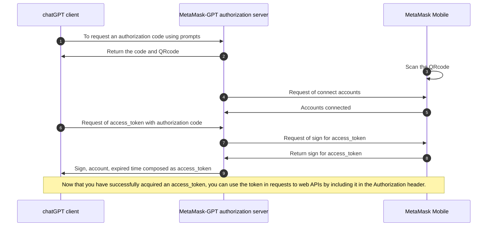

# Connect to MetaMask-GPT

You can connect to MetaMask-GPT by following the MetaMask-GPT authorization code flow which retrieve the MetaMask authorization code and QR code, generate a MetaMask token, and access the resources.
The MetaMask-GPT authorization code flow allows chatGPT client to obtain access tokens to access protected resources like getting selected accounts.
It starts with the prompts directing the user to the MetaMask-GPT authorization server, where the user authenticates and consents.
The MetaMask-GPT authorization server returns an authorization code to the client, which the client exchanges for an access token.

## Prompts to connect  MetaMask-GPT

```bash title="Prompts"
Goal: Establish a connection between the user’s MetaMask account and the GPT client, retrieve the MetaMask authorization code and QR code, generate a MetaMask token, and access the selected account.
1. Request MetaMask Authorization: request the MetaMask authorization code and MetaMask QR code from the GPT client to initiate the connection to MetaMask via the authorization server.
2. Retrieve Authorization Code & QR Code: once access to the authorization server is successful, retrieve the MetaMask authorization code and generate the MetaMask QR code.
3. Prompt for QR Code Scanning: ask the user: "Have you scanned the MetaMask QR code to connect your account?" 
4. Retrieve MetaMask Token: If the user responds Yes, proceed by exchanging the MetaMask authorization code for a MetaMask token.
5. Get Selected Account: Retrieve the user’s selected MetaMask account from the MetaMask mobile app.
```
:::tip
The prompts of connecting to MetaMask-GPT are improved by [Prompt Engineer GPT](https://chatgpt.com/g/g-5XtVuRE8Y-prompt-engineer). This GPT let you become a pro prompt engineer, by learning and applying best prompt practices.
:::

## The MetaMask authorization code flow
The chatGPT client using the MetaMask authorization code flow acquire an access_token and resources protected by the MetaMask-GPT identity platform (typically APIs). The MetaMask Code(mmCode) is equivalent to an OAuth 2.0 authorization code, which is a short-lived token used to exchange for the more durable MetaMask Token(mmToken), similar to the access token in OAuth.**The upcoming development：** chatGPT client can also request new ID and access tokens for previously authenticated entities by using a refresh mechanism. This diagram shows a high-level view of the authentication flow:


:::tip
Mermaid Chart, text-based diagramming helps to simplify documentation processes - improving workflows and communication among teams. [Mermaid Chart GPT](https://chatgpt.com/g/g-1IRFKwq4G-mermaid-chart-diagrams-and-charts) will create a wide range of charts and diagrams from markdown-style code.
:::

### Request an authorization code

Retrieve the MetaMask authorization code(mmCode) and generate the MetaMask QR code to be exchanged for a MetaMask token. mmCode has a limited validity time window, and if it's not exchanged for an mmToken within that time, it expires, much like how the authorization code in OAuth must be used within a limited period before becoming invalid. Once the mmCode is exchanged for the mmToken, the mmCode becomes immediately invalid, ensuring that it can't be reused, akin to the way OAuth invalidates the authorization code post-exchange.

```bash title="HTTP request"
GET /metamask/mmCode HTTP/1.1
Host: a588-34-170-192-71.ngrok-free.app
Content-Type: application/json
```

```bash title="HTTP successful response"
HTTP/1.1 200 OK
X-Powered-By: Express
Content-Type: application/json; charset=utf-8
{"qrcodeUrl":"https://a588-34-170-192-71.ngrok-free.app/03c6963d7db2a998bab719d3b643d52a639981f7347917e6b2f269cd05a1476dd6.png",
"mmCode":"03c6963d7db2a998bab719d3b643d52a639981f7347917e6b2f269cd05a1476dd6",
"NoteForAssistant":"display the image provided in the qrcodeUrl to the user"}
```

**mmCode and QRcode Generation:**
- For each request, a new MetaMask SDK instance is created in the MetaMask-GPT authorization server, similar to how OAuth generates a unique authorization flow for each session.
- Each SDK instance has a distinct channelId and pubKey, which function similarly to OAuth's session identifiers . 
- In this case, the pubKey is used as the session ID for managing user state without exposing the channelId.
- The pubKey is used both as the session ID and the mmCode, much like how OAuth sessions might associate a user ID or client_id with a session. 
- The QR code will be generated by the universalLink composed of MetaMask connect base URL, channelId and pubKey.

### Scan the QRcode

**Establishing a Secure Connection from Browser:** Scanning the QR code with your MetaMask mobile app initiates a secure communication channel between the dApp running in your browser and your MetaMask wallet on your mobile device. The QR code contains encoded information that helps link the session between the browser-based dApp and your mobile MetaMask wallet. After you san the QR code, the dApp running as MetaMask SDK instance and MetaMask Mobile will establish connection by [MetaMask socket.io server](https://docs.metamask.io/wallet/concepts/sdk/connections/#metamask-mobile-connection). The dApp will sync the status whether MetaMask Mobile connect to one seleted accouts. This allows the dApp to recognize and interact with your mobile wallet securely.

**Establishing a Secure Connection from chatGPT client:** Although the chatGPT client is runing in Browser, but it can not hold instances like MetaMask SDK. Now(25/09/2024) the chatGPT GPTs only have ability to get resources by API. Without MetaMask SDK instances in the chatGPT client, the client can not sync the status from MetaMask Mobile. So you must explicit instruction to chatGPT that you have sanned the QRcode. So in the prompts to connect MetaMask-GPT, GPT will ask users: "Have you scanned the MetaMask QR code to connect your account?" 

### Generate a MetaMask token

The **MetaMask token(mmToken)** is composed of expiration time, account, and signature. 

**expireTime:** This variable is used to set the expiration time for the token. It is expected to be in a format that can be converted to a Date object and then to an ISO 8601 string. The code takes this expiration time and uses it as part of the token generation process, ensuring that the token has a clear validity period.

**account:** The account parameter represents the user's account address that is involved in the signing process. It is essential for the eth_signTypedData_v4 method, as it specifies which account is signing the message. The account information is critical for verifying the token later and ensuring that it is tied to the correct user.

**sign:** The sign variable captures the signature generated by the provider when the eth_signTypedData_v4 method is called. This signature is crucial for the integrity and authenticity of the generated token. In the final token (mmToken), the signature, along with the expiration time and account, creates a composite string that can be used for authentication or validation purposes.

:::info
iii
:::
### Access the resources

## MetaMask-GPT Authorization Actions

```js title="Actions Schema"
openapi: 3.1.0
info:
  title: MetaMask-GPT authorization server
  description: The MetaMask-GPT authorization code flow allows chatGPT client to obtain access tokens to access protected resources like getting selected accounts. It starts with the prompts directing the user to the MetaMask-GPT authorization server, where the user authenticates and consents. The MetaMask-GPT authorization server returns an authorization code to the client, which the client exchanges for an access token.
  version: 1.0.0
servers:
  - url: https://a588-34-170-192-71.ngrok-free.app
    description: The goal of server is to establish a connection between the user’s MetaMask account and the GPT client, retrieve the MetaMask authorization code and QR code, generate a MetaMask token, and access the selected account. First, Request the MetaMask authorization code and MetaMask QR code from the GPT client to initiate the connection to MetaMask via the authorization server. Second, Once access to the authorization server is successful, retrieve the MetaMask authorization code and generate the MetaMask QR code. Third, ask the user "Have you scanned the MetaMask QR code to connect your account?" Fourth, If the user responds Yes, proceed by exchanging the MetaMask authorization code for a MetaMask token. Fifth, Retrieve the user’s selected MetaMask account from the MetaMask mobile app.
paths:
  //highlight-start
  /metamask/mmCode:
  //highlight-end
    get:
      operationId: getMetaMaskCode
      summary: Retrieve the MetaMask authorization code and generate the MetaMask QR code to be exchanged for a MetaMask token.
      responses:
        "200":
          description: The MetaMask authorization code and QR code generated to be exchanged for a MetaMask token.
          content:
            application/json:
              schema:
                type: object
                properties:
                  qrcodeUrl:
                    type: string
                  mmCode:
                    type: string
                  NoteForAssistant:
                    type: string
                example:
                  mmToken: 03a2299f702d0a7a1244bdcc4799bcd3ad2c804dff9ea6c992f1386cc05eeb622f
  //highlight-start
  /metamask/mmToken:
  //highlight-end
    post:
      operationId: getMetaMaskToken
      summary: After users have scanned the MetaMask QR code to connect your account, exchanging the MetaMask authorization code for a MetaMask token
      requestBody:
        description: Exchanging the MetaMask authorization code for a MetaMask token.
        required: true
        content:
          application/json:
            schema:
              type: object
              required:
                - mmCode
                - duration
              properties:
                mmCode:
                  type: string
                  description: The MetaMask code to be exchanged for a MetaMask token.
                duration:
                  type: integer
                  description: how long the MetaMask token will be alive in minute.
                  minimum: 180
      responses:
        "200":
          description: The MetaMask access tokens to access protected resources like getting selected accounts..
          content:
            application/json:
              schema:
                type: object
                properties:
                  mmToken:
                    type: string
  //highlight-start
  /metamask/getSelectedAccount:
  //highlight-end
    post:
      operationId: getSelectedAccount
      summary: get selected accounts from MetaMask mobile after getting MetaMask access tokens
      requestBody:
        description: Use MetaMask access tokens to get selected accounts
        required: true
        content:
          application/json:
            schema:
              type: object
              properties:
                mmToken:
                  type: string
                  description: The MetaMask access token is used to verify the identity of the user or client
      responses:
        "200":
          description: selected account successfully retrieved from MetaMask mobile
          content:
            application/json:
              schema:
                type: object
                properties:
                  account:
                    type: string
                    description: selected account from MetaMask mobile
        "400":
          description: Invalid MetaMask code or request format
        "500":
          description: Server error
```


