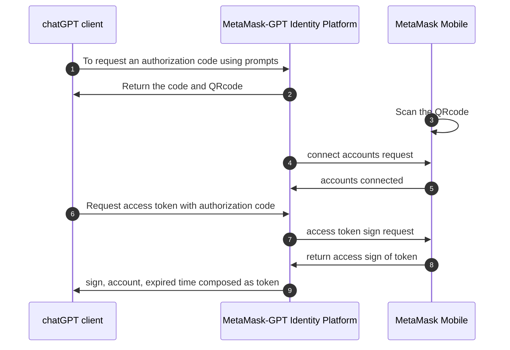

# Connect to MetaMask-GPT

You can connect to MetaMask-GPT by scanning MetaMask QRcode in chatGPT client and then connecting to your accounts.

The MetaMask-GPT authorization code flow allows chatGPT client to obtain access tokens to access protected resources like web APIs.
It starts with the prompts directing the user to the authorization server, where the user authenticates and consents.
The server returns an authorization code to the client, which the client exchanges for an access token.

:::info
Learn more about EIP-6963 in **Wallet interoperability**.
:::

:::tip
To connect to MetaMask without using EIP-6963, see the *Create a simple dapp** tutorial.
:::

## Connect to MetaMask-GPT using prompts

## Flow of MetaMask-GPT connection
The MetaMask authorization code flow is described in the following. chatGPT client using theMetaMask authorization code flow acquire an access_token to include in requests to resources protected by the MetaMask-GPT identity platform (typically APIs). 

**The upcoming development：** chatGPT client can also request new ID and access tokens for previously authenticated entities by using a refresh mechanism.

This diagram shows a high-level view of the authentication flow:

### MetaMask code

### MetaMask token
