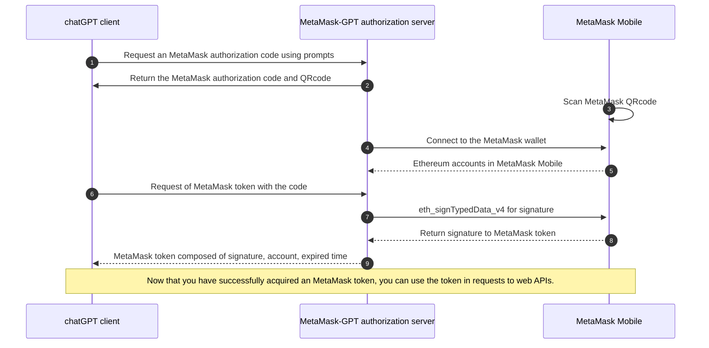

# Connect to MetaMask-GPT

You can connect to MetaMask-GPT by following the MetaMask-GPT authorization code flow which retrieve the MetaMask authorization code and QR code, generate a MetaMask token, and access the resources.
The MetaMask-GPT authorization code flow allows chatGPT client to obtain access tokens to access protected resources like getting selected accounts.
It starts with the prompts directing the user to the MetaMask-GPT authorization server, where the user authenticates and consents.
The MetaMask-GPT authorization server returns an authorization code to the client, which the client exchanges for an access token.

## Prompts to connect  MetaMask-GPT

```bash title="Prompts"
Goal: Establish a connection between the user’s MetaMask account and the GPT client, retrieve the MetaMask authorization code and QR code, generate a MetaMask token, and access the selected account.
1. Request MetaMask Authorization: request the MetaMask authorization code and MetaMask QR code from the GPT client to initiate the connection to MetaMask via the authorization server.
2. Retrieve Authorization Code & QR Code: once access to the authorization server is successful, retrieve the MetaMask authorization code and generate the MetaMask QR code.
3. Prompt for QR Code Scanning: ask the user: "Have you scanned the MetaMask QR code to connect your account?" 
4. Retrieve MetaMask Token: If the user responds Yes, proceed by exchanging the MetaMask authorization code for a MetaMask token.
5. Get Selected Account: Retrieve the user’s selected MetaMask account from the MetaMask mobile app.
```
:::tip
The prompts of connecting to MetaMask-GPT are improved by [Prompt Engineer GPT](https://chatgpt.com/g/g-5XtVuRE8Y-prompt-engineer). This GPT let you become a pro prompt engineer, by learning and applying best prompt practices.
:::

## The MetaMask authorization code flow
The chatGPT client using the MetaMask authorization code flow acquire an access token and resources protected by the MetaMask-GPT identity platform (typically APIs). "mmCode" is an abbreviation for the MetaMask authorization code, which is a temporary code used during the authorization flow to authenticate and exchange for an access token. "mmToken" is an abbreviation for the MetaMask Token, a short-lived access token used in the authorization flow. This token is exchanged after successful authentication using the mmCode (MetaMask authorization code) and is used to authorize subsequent API requests on behalf of the user. This diagram shows a high-level view of the MetaMask authorization code flow:


:::tip
[Mermaid Chart](https://mermaid.js.org/intro/), text-based diagramming helps to improve workflows and communication among teams. [Mermaid Chart GPT](https://chatgpt.com/g/g-1IRFKwq4G-mermaid-chart-diagrams-and-charts) will create a wide range of charts and diagrams from markdown-style code.
:::

### MetaMask authorization code request

MetaMask authorization code(mmCode) has a limited validity time window, and if it's not exchanged for an mmToken within that time, it expires, much like how the authorization code in OAuth must be used within a limited period before becoming invalid. Once the mmCode is exchanged for the mmToken, the mmCode becomes immediately invalid, ensuring that it can't be reused, akin to the way OAuth invalidates the authorization code post-exchange.

```bash title="HTTP request"
GET /metamask/mmCode HTTP/1.1
Host: a588-34-170-192-71.ngrok-free.app
Content-Type: application/json
```

```bash title="HTTP successful response"
HTTP/1.1 200 OK
X-Powered-By: Express
Content-Type: application/json; charset=utf-8
{"qrcodeUrl":"https://a588-34-170-192-71.ngrok-free.app/03c6963d7db2a998bab719d3b643d52a639981f7347917e6b2f269cd05a1476dd6.png",
"mmCode":"03c6963d7db2a998bab719d3b643d52a639981f7347917e6b2f269cd05a1476dd6",
"NoteForAssistant":"display the image provided in the qrcodeUrl to the user"}
```

mmCode and QR code Generation:
- For each request, a new MetaMask SDK instance is created in the MetaMask-GPT authorization server, similar to how OAuth generates a unique authorization flow for each session.
- Each SDK instance has a distinct channelId and pubKey, which function similarly to OAuth's session identifiers . 
- In this case, the pubKey is used as the session ID for managing user state without exposing the channelId.
- The pubKey is used both as the session ID and the mmCode, much like how OAuth sessions might associate a user ID or client_id with a session. 
- The QR code will be generated by the universalLink composed of MetaMask connect base URL, channelId and pubKey.

### Scan the QRcode

**Establishing a Secure Connection from Browser:** Scanning the QR code with your MetaMask mobile app initiates a secure communication channel between the dApp running in your browser and your MetaMask wallet on your mobile device. The QR code contains encoded information that helps link the session between the browser-based dApp and your mobile MetaMask wallet. After you san the QR code, the dApp running as MetaMask SDK instance and MetaMask Mobile will establish connection by [MetaMask socket.io server](https://docs.metamask.io/wallet/concepts/sdk/connections/#metamask-mobile-connection). The dApp will sync the status whether MetaMask Mobile connect to one seleted accouts. This allows the dApp to recognize and interact with your mobile wallet securely.

**Establishing a Secure Connection from chatGPT client:** Although the chatGPT client is runing in Browser, but it can not hold instances like MetaMask SDK. Now(25/09/2024) the chatGPT GPTs only have ability to get resources by API. Without MetaMask SDK instances in the chatGPT client, the client can not sync the status from MetaMask Mobile. So you must explicit instruction to chatGPT that you have sanned the QRcode. So in the prompts to connect MetaMask-GPT, GPT will ask users: "Have you scanned the MetaMask QR code to connect your account?" 

### Connect to the MetaMask wallet
After one user scanning the QR code by MetaMask Mobile, the eth_requestAccounts is commonly called to connect their MetaMask wallet from the MetaMask SDK which in MetaMask-GPT authorization server. After that, other API methods can be used to interact with the Ethereum blockchain on behalf of the user. Here’s a step-by-step breakdown of what happens when connect the MetaMask wallet and eth_requestAccounts is called:

- **Request Access:** The MetaMask SDK calls **eth_requestAccounts** to ask for access to the user's MetaMask accounts.

- **MetaMask Prompt:** MetaMask Mobile will display a dialog to the user asking if you want to connect your wallet with your account(s).

- **User Approval:** The user must approve or reject the connection request. If they approve, the MetaMask SDK will be granted access to view the selected Ethereum address and send transactions from it.

- **Response:** The promise returned by eth_requestAccounts will resolve with an array of account addresses that the user approved. Typically, this will include the default Ethereum account in MetaMask Mobile.


### MetaMask token Generation

The **MetaMask token(mmToken)** is composed of expiration time, account, and signature. 

**expireTime:** This variable is used to set the expiration time for the token. It is expected to be in a format that can be converted to a Date object and then to an ISO 8601 string. The code takes this expiration time and uses it as part of the token generation process, ensuring that the token has a clear validity period.

**account:** The account parameter represents the user's account address that is involved in the signing process. It is essential for the eth_signTypedData_v4 method, as it specifies which account is signing the message. The account information is critical for verifying the token later and ensuring that it is tied to the correct user.

**signature:** The signature generated by the provider when the eth_signTypedData_v4 method is called. This signature is crucial for the integrity and authenticity of the generated token. In the final token (mmToken), the signature, along with the expiration time and account, creates a composite string that can be used for authentication or validation purposes.

:::info
I’ve tried to create mmToken to function like a JWT by [Panva Jose](https://github.com/panva/jose), but the signatures generated by eth_signTypedData_v4 and personal_sign differ from a JWT's.
**eth_signTypedData_v4** have to set fixed format structure which can not convert and equal to header and payload format.
**personal_sign** will add some prefix when sign the string.
So if can not use JWT like Panva Jose, all the generation, verification and other powerful tools and extention will be no way to help.
If you have any good idea, please let me know. Thanks.
:::

```bash title="HTTP request"
POST /metamask/mmToken HTTP/1.1
Host: a588-34-170-192-71.ngrok-free.app
User-Agent: Mozilla/5.0 AppleWebKit/537.36 (KHTML, like Gecko); compatible; ChatGPT-User/1.0; +https://openai.com/bot
Content-Type: application/json
{"mmCode": "03c6963d7db2a998bab719d3b643d52a639981f7347917e6b2f269cd05a1476dd6", "duration": 10}
```

```bash title="HTTP successful response"
HTTP/1.1 200 OK
X-Powered-By: Express
Content-Type: application/json; charset=utf-8
{"mmToken":"1727018256602.0x4477610799e7910f0e40f64da702aa9ffcf929ac.0xc682b4105848e0c50a0c8a02f96528b5cd8940322ca5b2080e13585f34640a596068fa69ff9241d33e2f1ee0752bb29498f28f66067a10594cfdf585861ffa661c",
"NoteForAssistant":"use mmToken to access the resource in the provider"}
```

[`eth_signTypedData_v4`](https://docs.metamask.io/wallet/how-to/sign-data/#use-eth_signtypeddata_v4) provides the most human-readable signatures that are efficient to process on-chain. It follows the [EIP-712](https://eips.ethereum.org/EIPS/eip-712) specification to allow users to sign typed structured data that can be verified on-chain. An `eth_signTypedData_v4` payload uses a standard format of encoding structs, but has a different format for the top-level struct that is signed, which includes some metadata about the verifying contract to provide replay protection of these signatures between different contract instances.

```javascript title="eth_signTypedData_v4 EIP-712 structure"
const getMsgParams = (account, expireTime) => {
        const dateObject = new Date(expireTime); 
        const isoString = dateObject.toISOString();

        const msgParams = {
            domain: {
                chainId: '0x1',
                name: 'MetaMask-GPT Connection',
                verifyingContract: '0xCcCCccccCCCCcCCCCCCcCcCccCcCCCcCcccccccC',
                version: '1',
            },
            message: {
                exp: isoString,
                iss: account,
            },
            primaryType: 'Code',
            types: {
                EIP712Domain: [
                    { name: 'name', type: 'string' },
                    { name: 'version', type: 'string' },
                    { name: 'chainId', type: 'uint256' },
                    { name: 'verifyingContract', type: 'address' },
                ],
                Code: [
                    { name: 'iss', type: 'string' },
                    { name: 'exp', type: 'string' },
                ],
            },
        };

        return msgParams;
    };
```
eth_signTypedData_v4 presents a data message for the user to sign in a structured and readable format and returns the signed response. 

When calling eth_signTypedData_v4 in the MetaMask SDK, the MetaMask Mobile app will handle the confirmation.
- Once the eth_signTypedData_v4 signing request is initiated, if the user is on MetaMask Mobile, they will receive a push notification or in-app prompt asking them to confirm the signature request.
- On mobile, you will see the structured data they are being asked to sign and can either accept or reject it.
- Once you confirm, the signed data will be sent back to MetaMask-GPT authorization server, where you can handle it for further processing.
- At last, the expiration time, account, and signature are combined to form the MetaMask token (mmToken).

```javascript title="mmToken generation"
    async tokenGenerate(sdk, account, expireTime) {
        const provider = sdk.getProvider();
        let sign = null;

        const dateObject = new Date(expireTime); 
        const isoString = dateObject.toISOString();
        const msgParams = getMsgParams(account, expireTime);

        try {
            //highlight-start
            sign = await provider.request({
                method: 'eth_signTypedData_v4',
                params: [account, JSON.stringify(msgParams)],
            });
            //highlight-end
        } catch (err) {
            console.error(err);
        }
        //highlight-start
        const mmToken = `${expireTime}.${account}.${sign}`;
        //highlight-end
        return mmToken;
    }
```


### Access the resources
In The MetaMask authorization code flow, obtaining an MetaMask token is a critical step that allows a client application to securely access protected resources on behalf of a user. The MetaMask token serves as proof that the client has been authorized, and it must be presented with each request to the resource server. This mechanism ensures that resource servers can enforce access controls and that user data remains secure.

In OAuth 2.0, the standard and recommended method for a client to send an access token when accessing protected resources is to include it in the Authorization header using the Bearer token scheme:

```bash title="HTTP REQUEST: Token in OAuth 2.0 code flow"
GET /resource HTTP/1.1
Host: api.example.com
Authorization: Bearer {access_token}
```

But the ChatGPT action API currently does not support custom headers, including the Authorization header. This limitation means that you cannot send the access token in the header as per the standard OAuth 2.0 practice. As a result, you have to include the token in the POST body instead.

```bash title="HTTP REQUEST: Token in MetaMask auth code flow"
POST /metamask/getSelectedAccount HTTP/1.1
Host: a588-34-170-192-71.ngrok-free.app
User-Agent: Mozilla/5.0 AppleWebKit/537.36 (KHTML, like Gecko); compatible; ChatGPT-User/1.0; +https://openai.com/bot
{"mmToken": "1727018256602.0x4477610799e7910f0e40f64da702aa9ffcf929ac.0xc682b4105848e0c50a0c8a02f96528b5cd8940322ca5b2080e13585f34640a596068fa69ff9241d33e2f1ee0752bb29498f28f66067a10594cfdf585861ffa661c"}
```

The resource server validates the access token to ensure it is authentic, unexpired, and has the necessary scopes (permissions) for the requested resource.
Validation may involve checking the token's signature and expiration time.

```javascript title="mmToken Verification"
const verifyMetaMaskToken = (req, res, next) => {
    // Check for the token in the request body
    const mmToken = req.body.mmToken; 
    if (mmToken && mmToken.split('.').length == 3) {
        const parts = mmToken.split('.');
        const expireTimeStr = parts[0];
        const account = parts[1];
        const sign = parts[2];
        const expireTime = Number(expireTimeStr);

        let timeout = false;
        if (Date.now()  > expireTime) {
            // Token has expired, terminate the session and remove from MetaMaskSDKManager
            timeout = true;
        }

        const msgParams = getMsgParams(account, expireTime);
        try {
            const recoveredAddr = recoverTypedSignature({
                data: msgParams,
                signature: sign,
                version: 'V4',
            });

            if (!timeout && toChecksumAddress(recoveredAddr) === toChecksumAddress(account)) {
                req.account = account;
                next();
            } else {
                if (timeout) {   // Token has expired
                    console.log(`Token has expired`);
                } else {
                    console.log(`Failed to verify signer when comparing ${recoveredAddr} to ${from}`);
                }
                return res.redirect('/metamask/mmCode');
            }
        } catch (e) {
            console.error(e);
            return res.redirect('/metamask/mmCode');
        }
    } else {
        // If no token is present, redirect to get a new token
        return res.redirect('/metamask/mmCode');
    }
}
```

The resource server processes the request and returns the requested data or performs the desired action.

```bash title="HTTP successful response"
HTTP/1.1 200 OK
X-Powered-By: Express
Content-Type: application/json; charset=utf-8
{"account":"0x4477610799e7910f0e40f64da702aa9ffcf929ac"}
```

:::info
We recommend using [`eth-sig-util`](https://github.com/MetaMask/eth-sig-util) to generate and validate signatures. You can use [`eip712-codegen`](https://github.com/danfinlay/eip712-codegen#readme) to generate most of the Solidity required to verify these signatures on-chain. It currently doesn't generate the top-level struct verification code, so you must write that part manually. See
[this example implementation](https://github.com/delegatable/delegatable-sol/blob/fb34bb259890417285f7185bc6500fb0ab8bf86f/contracts/Delegatable.sol#L80).
:::

## MetaMask-GPT Authorization Actions

```js title="Actions Schema"
openapi: 3.1.0
info:
  title: MetaMask-GPT authorization server
  description: The MetaMask-GPT authorization code flow allows chatGPT client to obtain access tokens to access protected resources like getting selected accounts. It starts with the prompts directing the user to the MetaMask-GPT authorization server, where the user authenticates and consents. The MetaMask-GPT authorization server returns an authorization code to the client, which the client exchanges for an access token.
  version: 1.0.0
servers:
  - url: https://a588-34-170-192-71.ngrok-free.app
    description: The goal of server is to establish a connection between the user’s MetaMask account and the GPT client, retrieve the MetaMask authorization code and QR code, generate a MetaMask token, and access the selected account. First, Request the MetaMask authorization code and MetaMask QR code from the GPT client to initiate the connection to MetaMask via the authorization server. Second, Once access to the authorization server is successful, retrieve the MetaMask authorization code and generate the MetaMask QR code. Third, ask the user "Have you scanned the MetaMask QR code to connect your account?" Fourth, If the user responds Yes, proceed by exchanging the MetaMask authorization code for a MetaMask token. Fifth, Retrieve the user’s selected MetaMask account from the MetaMask mobile app.
paths:
  //highlight-start
  /metamask/mmCode:
  //highlight-end
    get:
      operationId: getMetaMaskCode
      summary: Retrieve the MetaMask authorization code and generate the MetaMask QR code to be exchanged for a MetaMask token.
      responses:
        "200":
          description: The MetaMask authorization code and QR code generated to be exchanged for a MetaMask token.
          content:
            application/json:
              schema:
                type: object
                properties:
                  qrcodeUrl:
                    type: string
                  mmCode:
                    type: string
                  NoteForAssistant:
                    type: string
                example:
                  mmToken: 03a2299f702d0a7a1244bdcc4799bcd3ad2c804dff9ea6c992f1386cc05eeb622f
  //highlight-start
  /metamask/mmToken:
  //highlight-end
    post:
      operationId: getMetaMaskToken
      summary: After users have scanned the MetaMask QR code to connect your account, exchanging the MetaMask authorization code for a MetaMask token
      requestBody:
        description: Exchanging the MetaMask authorization code for a MetaMask token.
        required: true
        content:
          application/json:
            schema:
              type: object
              required:
                - mmCode
                - duration
              properties:
                mmCode:
                  type: string
                  description: The MetaMask code to be exchanged for a MetaMask token.
                duration:
                  type: integer
                  description: how long the MetaMask token will be alive in minute.
                  minimum: 180
      responses:
        "200":
          description: The MetaMask access tokens to access protected resources like getting selected accounts..
          content:
            application/json:
              schema:
                type: object
                properties:
                  mmToken:
                    type: string
  //highlight-start
  /metamask/getSelectedAccount:
  //highlight-end
    post:
      operationId: getSelectedAccount
      summary: get selected accounts from MetaMask mobile after getting MetaMask access tokens
      requestBody:
        description: Use MetaMask access tokens to get selected accounts
        required: true
        content:
          application/json:
            schema:
              type: object
              properties:
                mmToken:
                  type: string
                  description: The MetaMask access token is used to verify the identity of the user or client
      responses:
        "200":
          description: selected account successfully retrieved from MetaMask mobile
          content:
            application/json:
              schema:
                type: object
                properties:
                  account:
                    type: string
                    description: selected account from MetaMask mobile
        "400":
          description: Invalid MetaMask code or request format
        "500":
          description: Server error
```


